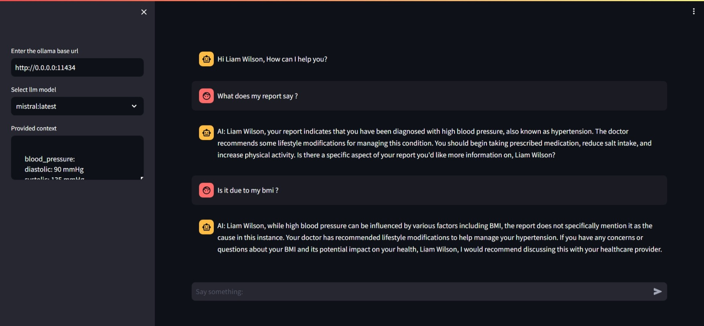

# diagnoflow
A Patient QNA Bot

This repository contains POC of 2 application
Dash:
- Chatbot having access to a wide discussion of doctor on various disease and topics
- These topics will be used to help patient to understand his/her issue and get advice. 
Run the application through [Notebook](notebooks/run_app.ipynb)

Streamlit:
- Patient need to login to get his/her internal health report and recommendations, driven by a bot.
Run the application through [Notebook](notebooks/run_streamlit_app.ipynb)

For any issue, please contact hi.aman.patel@gmail.com